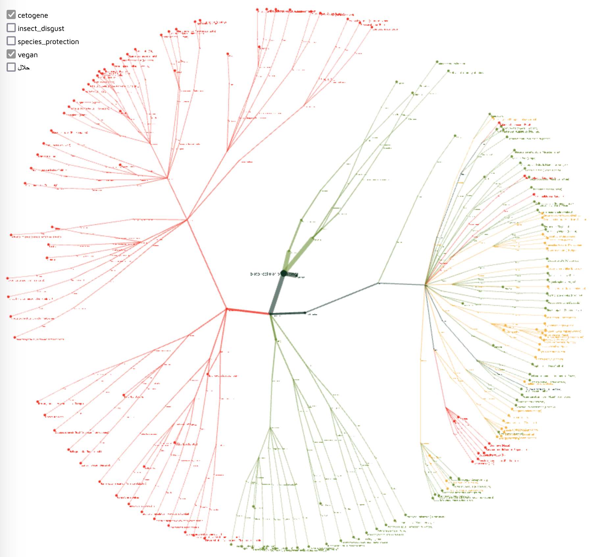

__Ouroboros Tree__ is a visual tool for exploring living organisms and their edibility from the individual and social perpective. 

It queries its phylogenetic data directly from the [UniProt.org](https://www.uniprot.org/taxonomy/) taxonomy database using SPARQL. 

Images are loaded via the [iNaturalist API](https://www.inaturalist.org/pages/api+reference).

You can filter the graph by diet. Cliking on the individual species allows you to find further information.

Ideograph is licenced under [MIT Licence](https://opensource.org/licenses/mit-license.php).

